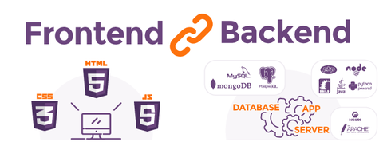
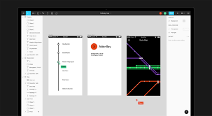

# Web 1

---

## Terminologies

We should know the main difference between Internet vs The Web vs The Cloud. Basically, Internet is the main network that connect a lot of computers in the world. While the Web is intended to publish the website on the Internet. Then the Cloud? Well, it's just a fancy name for the Internet or application service provided by various companies.

Then it's important to know why website and web application are aiming for two different things. Website is mostly static and informational; while web application is designed to be dynamic, interactive, and can save our data.

What are your favorite website or web app? That you use everyday, you can't live without. Take some inspiration!

---

## Full Stack Web

Full stack web is just a cool name for saying we're building web application that covers frontend and backend parts of a website.

Frontend is for the main user interaction, mostly with GUI (Graphical User Interface). Coded with HTML, CSS, and programmed JavaScript.

Backend is the hidden engine that most users don't know, mostly interacted with CLI (Command Line Interaction). Can be programmed using one of various backend languages and platforms: Node.js and Express.js, Ruby and Rails, Python and Django, PHP and Laravel, Java and Spring, Go, Scala, and many more.

---

## MVP (Minimum Viable Product)

While building a project or product, we tend to view the complete huge application we want to have. But realistically when building it, we should start small even though we want to think big.

By thinking in MVP, we build something first as small as possible. So we can launch faster or earlier, with only the most imporant features.

---

## UI (User Interface) Design

### Wireframe vs Mockup vs Prototype

Commonly when designing a website or application, we are recommended to visualize it first.

Wireframing is the easiest design method to create just the essentials. Plan out the content, positioning, and more.

Mockup is the bare minimum of the design. We can see better layout, colors, typography, images, and more.

Prototype is often the advanced one where we can make the mockup interactively used. Without having to code it.

### Design Tool

Nowadays, we can just use online design tool to create a mockup or graphic design. Let's use [Figma](https://figma.com) for a start, and follow along with the predefined design wireframe/mockup for our app.
