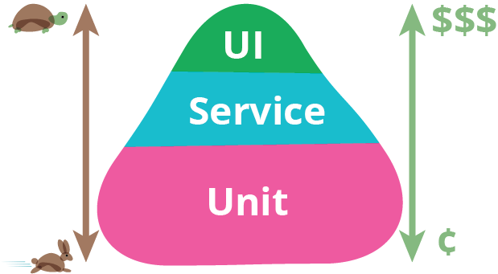

# Part 20

---

* ▢ Testing Methodologies
  * Unit
  * Functional
  * Integration/API
  * E2E
* ▢ Testing Tools
  * Mocha, Chai, Jasmine, Karma, Selenium, Nightmare, CucumberJS
* ▢ Testing Techniques
  * TDD (Test Driven Development)
  * BDD (Behavior Driven Development)
  * ATDD (Automated Test Driven Development)
  * HDD (Hypothesis Driven Development)
  * Continuous Integration (CI): Jenkins, Travis
  * Continuous Deployment (CD)

---

# Testing Methodologies

* Unit
* Functional
* Integration/API
* End-to-End (E2E)

## References

* [TestPyramid](https://martinfowler.com/bliki/TestPyramid.html)
* [The Practical Test Pyramid](https://martinfowler.com/articles/practical-test-pyramid.html)
* [The Testing Pyramid](http://www.agilenutshell.com/episodes/41-testing-pyramid)

---

# Testing Tools

* Mocha
* Chai
* Jasmine
* Karma
* Selenium
* Nightmare
* CucumberJS

## References

---

# Testing Techniques

* TDD (Test Driven Development)
* BDD (Behavior Driven Development)
* ATDD (Automated Test Driven Development)
* HDD (Hypothesis Driven Development)

## Continuous Integration (CI)

* Jenkins
* Travis

## Continuous Deployment (CD)

* Codeship

## References

* [Codeship](https://codeship.com)
