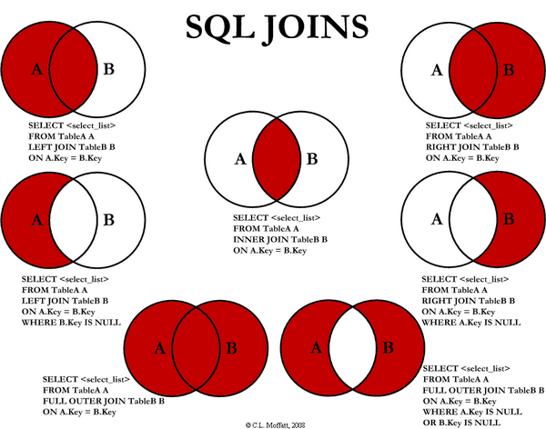

# Part 21

---

# Relational Database

The most common database structure is build upon relational model.

The data modeling itself contains entities/tables of fields and values, consisted in rows and columns.

In each table, data schema can be created to give the requirement of the data.

**Table View**

```sh
Users
+----+-------+------------------+
| id | name  | email            | # Field
+----+-------+------------------+
|  1 | Alpha | alpha@domain.com | # Record/Row
|  2 | Beta  | beta@domain.com  |
+----+-------+------------------+
# Column

Todos
+----+--------------+-----------+
| id | text         | person_id |
+----+--------------+-----------+
|  1 | Learn coding |  1        |
|  2 | Apply a job  |  2        |
+----+--------------+-----------+

Addresses
+----+------------+-----------+
| id | address    | person_id |
+----+------------+-----------+
|  1 | Ex Street  |  1        |
|  2 | Way Street |  2        |
+----+------------+-----------+
```

**Schema View**


* Field = Every table is broken up into smaller entities called fields. The fields in the `Users` table consist of `id`, `name`, `email`.
* Record/Row = A record is also called as a row of data is each individual entry that exists in a table.
* Column = A column is a vertical entity in a table that contains all information associated with a specific field in a table.

---

# SQL (Structured Query Language)

SQL itself is a query language that often used for storing, manipulating, and retrieving data stored in a relational database.

It allows to:

* access data in the relational database management systems.
* describe the data.
* define the data in a database and manipulate that data.
* within other languages using SQL modules, libraries, and pre-compilers.
* create and drop databases and tables.
* create view, stored procedure, functions in a database.
* set permissions on tables, procedures, and views.

## References

* [A Gentle Introduction to SQL and NoSQL Databases – Jimmy Farrell’s Blog – Medium](https://medium.com/jimmy-farrell/a-gentle-introduction-to-sql-and-nosql-databases-347e53056b06)
* [SQL Tutorial - TutorialsPoint](https://www.tutorialspoint.com/sql/index.htm)
  * [SQL Syntax](https://www.tutorialspoint.com/sql/sql-syntax.htm)
* [SQL Tutorial - w3schools](https://www.w3schools.com/sql/default.asp)

---

# DBMS (Database Management System)

To actually use a SQL database in our program, we need a DBMS or database server; such as SQLite, MySQL/MariaDB, PostgreSQL, Oracle, Informix, Microsoft SQL Server, etc.

## References

* [SQLite](https://www.sqlite.org)
  * [SQLite Tutorial](https://www.tutorialspoint.com/sqlite/index.htm)
  * [DevDocs — SQLite documentation](http://devdocs.io/sqlite)
* [MySQL](https://www.mysql.com)
  * [`mycli` - MyCLI is a command line interface for MySQL, MariaDB, and Percona with auto-completion and syntax highlighting](https://www.mycli.net)
  * [MySQL Tutorial](https://www.tutorialspoint.com/mysql/index.htm)
  * [MySQL Tutorial - Learn MySQL Fast, Easy and Fun](http://www.mysqltutorial.org)
    * [MySQL Sample Database](http://www.mysqltutorial.org/mysql-sample-database-aspx)
* [MariaDB](https://mariadb.org)
  * [MariaDB Tutorial](https://www.tutorialspoint.com/mariadb/index.htm)
* [PostgreSQL](https://www.postgresql.org)
  * [`pgcli` - Pgcli is a command line interface for Postgres with auto-completion and syntax highlighting](https://www.pgcli.com)
  * [PostgreSQL Tutorial](https://www.tutorialspoint.com/postgresql/index.htm)
  * [DevDocs — PostgreSQL 10 documentation](http://devdocs.io/postgresql~10)
* [CockroachDB - The SQL database for global cloud services](https://www.cockroachlabs.com)
* [Google Cloud SQL - MySQL & PostgreSQL Relational Database Service](https://cloud.google.com/sql)
* [Amazon Relational Database Service (RDS) – AWS](https://aws.amazon.com/rds)
* [Microsoft Azure SQL Database – Cloud Database as a Service](https://azure.microsoft.com/en-us/services/sql-database)

---

# SQL Database Tools

Then in order to access and use the installed database, we have to use a CLI or GUI tool.

## References

* [`mysql` — The MySQL Command-Line Tool](https://dev.mysql.com/doc/refman/5.7/en/mysql.html)
* [`mycli` - A Terminal Client for MySQL with AutoCompletion and Syntax Highlighting](http://www.mycli.net)
* [MySQL Workbench](https://www.mysql.com/products/workbench)
* [TeamSQL - Cross-platform SQL Client for MySQL, PostgreSQL, Microsoft SQL Server, Amazon Redshift and Redis](https://teamsql.io)

---

# SQL Database Hosting

There are various hosting solutions for SQL database that available for free. But for customized solution, we still need to install them in our own server or use a cloud service.

## References

* [Heroku Postgres - SQL Database Service on Heroku](https://www.heroku.com/postgres)
* [A Basic MySQL Tutorial | DigitalOcean](https://www.digitalocean.com/community/tutorials/a-basic-mysql-tutorial)
* [Caspio - Free Online Database | Create Easy Cloud Applications](https://free.caspio.com)

---

# Entity Relations/Associations

In relational database design, entities or tables are representing the overview of the data.

Tables can have relations, connections, or associations between other tables.

The relationship between tables can be as:

* 1 to 1
  * Example: One person has one salary
* 1 to many / many to one
  * Example: One person has many addresses, or many addresses are owned by one person
* many to many
  * Example: Many persons has many orders, and many orders have many items

To optimize the design, normalization is done as the process of organizing a database to:

* Reduce redundancy / eliminating redundant data. For example, storing the same data in more than one table.
* Ensure data dependencies make sense, or improve data integrity.

## References

* [SQL Tables Explained by Voting in an election](https://medium.com/@kevink/sql-tables-explained-by-voting-in-the-infamous-2016-election-de638dd9db7)
* [The 3 Types of Relationships in Database Design | Database.Guide](http://database.guide/the-3-types-of-relationships-in-database-design)
* [SQL for Beginners: Part 3 - Database Relationships](https://code.tutsplus.com/articles/sql-for-beginners-part-3-database-relationships--net-8561)
* [What is Normalization? | Database.Guide](http://database.guide/what-is-normalization)

---

# SQL Query/Syntax/Command

These syntaxes can be classified into the following groups based on their nature of statements.

## DDL - Data Definition Language

* `CREATE` = Creates a new table, a view of a table, or other object in the database.
* `ALTER` = Modifies an existing database object, such as a table.
* `DROP` = Deletes an entire table, a view of a table or other objects in the database.

## DML - Data Manipulation Language

* `SELECT` = Retrieves certain records from one or more tables.
* `INSERT` = Creates a record.
* `UPDATE` = Modifies records.
* `DELETE` = Deletes records.

## DCL - Data Control Language

* `GRANT` = Gives a privilege to user.
* `REVOKE` = Takes back privileges granted from user.

## Statement Examples

Show existing databases.

```sql
SHOW DATABASES;
```

Create a new database.

```sql
CREATE DATABASE database_name;
```

Use a created database.

```sql
USE database_name;
```

Create a new table with various fields.

```sql
CREATE TABLE table_name(
column1 datatype,
column2 datatype,
column3 datatype,
.....
columnN datatype,
PRIMARY KEY( one or more columns )
);
```

Get selected fields from selected table.

```sql
SELECT column1, column2....columnN
FROM   table_name;
```

Get selected fields from selected table with a condition.

```sql
SELECT column1, column2....columnN
FROM   table_name
WHERE  CONDITION;
```

---

# SQL Table Join

The SQL Joins clause is used to combine records from two or more tables in a database. A JOIN is a means for combining fields from two tables by using values common to each.

There are different types of joins available in SQL:

* INNER JOIN − returns rows when there is a match in both tables.
* OUTER JOIN - returns rows when there is an excluding match in both tables.
* LEFT JOIN − returns all rows from the left table, even if there are no matches in the right table.
* RIGHT JOIN − returns all rows from the right table, even if there are no matches in the left table.
* FULL JOIN − returns rows when there is a match in one of the tables.
* SELF JOIN − is used to join a table to itself as if the table were two tables, temporarily renaming at least one table in the SQL statement.
* CARTESIAN JOIN − returns the Cartesian product of the sets of records from the two or more joined tables.



## References

* [SQL Using Joins](https://www.tutorialspoint.com/sql/sql-using-joins.htm)

---

# Database ACID

Desired transactions in a SQL database is often have ACID (Atomic Consistent Isolated Durable) properties.

**Atomic**

All changes are made (commit) or none (rollback). Atomicity takes individual operations and turns them into an all-or-nothing unit of work, succeeding if and only if all contained operations succeed.

**Consistent**

Transaction won't violate declared system integrity constraints. Consistency means that constraints are enforced for every committed transaction. That implies that all Keys, Data types, Checks and Trigger are successful and no constraint violation is triggered.

**Isolated**

Results independent of concurrent transactions. Isolation brings us the benefit of hiding uncommitted state changes from the outside world, as failing transactions shouldn’t ever corrupt the state of the system

**Durable**

Committed changes survive various classes of hardware failure. A successful transaction must permanently change the state of a system, and before ending it, the state changes are recorded in a persisted transaction log. If our system is suddenly affected by a system crash or a power outage, then all unfinished committed transactions may be replayed.

## References

* [A beginner's guide to ACID and database transactions - Vlad Mihalcea](https://vladmihalcea.com/a-beginners-guide-to-acid-and-database-transactions/)
* [ACID and database transactions? - Stack Overflow](https://stackoverflow.com/questions/3740280/acid-and-database-transactions)
* [Atomic Consistent Isolated Durable](http://wiki.c2.com/?AtomicConsistentIsolatedDurable)

---

# Database CAP Theorem

**Consistency**

When performing a “read” from one node in the system, you always receive the most recent “write”, even if that “write” occurred on a different node. Different than the “consistency” in ACID.

**Availability**

When a request is made to a node, as long as the node has not failed, it will respond to the request.

**Partition Tolerance**

When a node is removed from the system, the system continues to operate and uphold its other attributes.

---

# Database Trivia

* Database Indexing
* Entity Relationship Diagram (ERD)
* Data Flow Diagram (DFD)
* Extract, Transform, Load (ETL)

---

# References

* [What is a database index?](http://www.vertabelo.com/blog/technical-articles/what-is-a-database-index)
* [Database Indexes Explained - Essential SQL](https://www.essentialsql.com/what-is-a-database-index)
* [The Basics of Database Indexes For Relational Databases](https://medium.com/jimmy-farrell/the-basics-of-database-indexes-for-relational-databases-bfc634d6bb37)
* [Entity Relationship Diagram - Everything You Need to Know About ER Diagrams](https://www.smartdraw.com/entity-relationship-diagram)
* [What is a Data Flow Diagram | Lucidchart](https://www.lucidchart.com/pages/data-flow-diagram)
* [ETL Process](http://datawarehouse4u.info/ETL-process.html)

---

# SQL Project 1

* [SQL Project 1](../../modules/sql-project-1/README.md)