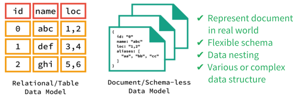

# Part 23

---

# Database NoSQL

NoSQL (not only SQL) database provides a mechanism for storage and retrieval of data that is modeled in other than using relational way.

Data manipulation is often done through object-oriented functions or APIs. There's no specific query language like SQL.

## NoSQL Database Types

**Document databases:** pair each key with a complex data structure known as a document. Documents can contain many different key-value pairs, or key-array pairs, or even nested documents.

**Graph stores:** are used to store information about networks of data, such as social connections. Graph stores include Neo4J and Giraph.

**Key-value stores:** are the simplest NoSQL databases. Every single item in the database is stored as an attribute name (or 'key'), together with its value. Examples of key-value stores are Riak and Berkeley DB. Some key-value stores, such as Redis, allow each value to have a type, such as 'integer', which adds functionality.

**Wide-column stores:** such as Cassandra and HBase are optimized for queries over large datasets, and store columns of data together, instead of rows.

## Examples

There more than 220 NoSQL databases exist. Some of the populars based on their categories are:

* Document
  * MongoDB
  * Firebase
  * ArangoDB
  * CouchDB
  * PouchDB
  * NeDB
* Key/Value
  * Redis
  * DynamoDB
  * Cassandra
* Search
  * Elastic Search
* Big Data
  * Apache Hadoop
  * Apache Ignite
* Graph-based
  * Neo4j
  * Dgraph
  * Neptune
* Analytical
  * Druid
* Time Series
  * Influx
  * Timescale

## Installation and Usage

For detailed guidance, refer to needed documentation on each database.

## References

* [NoSQL Databases Explained | MongoDB](https://www.mongodb.com/nosql-explained)
* [NoSQL Databases](http://nosql-database.org)
* [MongoDB for GIANT Ideas](https://www.mongodb.com)
  * [MongoDB University](https://university.mongodb.com)
  * [mongo Shell Quick Reference — MongoDB Manual](https://docs.mongodb.com/manual/reference/mongo-shell)
  * [MongoDB Tutorial](https://www.tutorialspoint.com/mongodb/index.htm)
* [Firebase](https://firebase.google.com)
* [PouchDB, the JavaScript Database that Syncs](https://pouchdb.com)
  * [PouchDB Tutorial](https://www.tutorialspoint.com/pouchdb/index.htm)
* [Apache CouchDB](http://couchdb.apache.org)
  * [CouchDB: The Definitive Guide](http://guide.couchdb.org)
  * [Apache CouchDB Documentation](http://docs.couchdb.org)
  * [CouchDB Tutorial](https://www.tutorialspoint.com/couchdb/index.htm)
* [Couchbase: NoSQL Engagement Database](https://www.couchbase.com)
* [Redis](https://redis.io)
* [ArangoDB - highly available multi-model NoSQL database](https://www.arangodb.com)
* [Aerospike - High Performance NoSQL Database](https://www.aerospike.com)
* [Apache Cassandra](https://cassandra.apache.org)
* [Apache™ Hadoop® / HBase](http://hadoop.apache.org)
* [Neo4j](https://neo4j.com)

---

# NoSQL Tools

MongoDB management tool or admin UIs are Robo 3T / Studio 3T (formerly Robomongo) and MongoDB Compass.

## References

* [Robo 3T / Studio 3T / Robomongo](https://robomongo.org)
* [MongoDB Compass](https://www.mongodb.com/products/compass)

---

# NoSQL Hosted

Hosted solutions for MongoDB are mLab or MongoDB Atlas.

Meanwhile, Firebase is hosted on its own.

## References

* [mLab MongoDB Hosting: Database-as-a-Service](https://mlab.com)
* [MongoDB Atlas - Fully Managed MongoDB, hosted on AWS, Azure, and GCP](https://www.mongodb.com/cloud/atlas)
