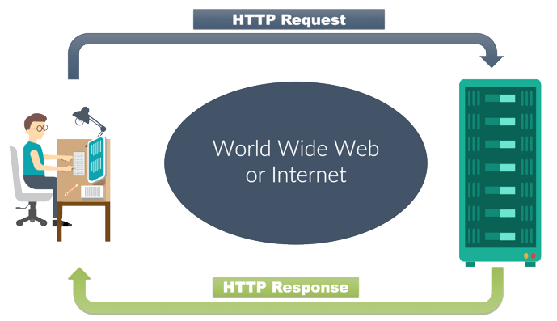
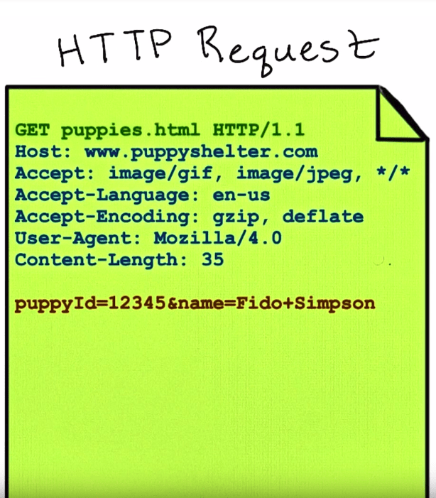
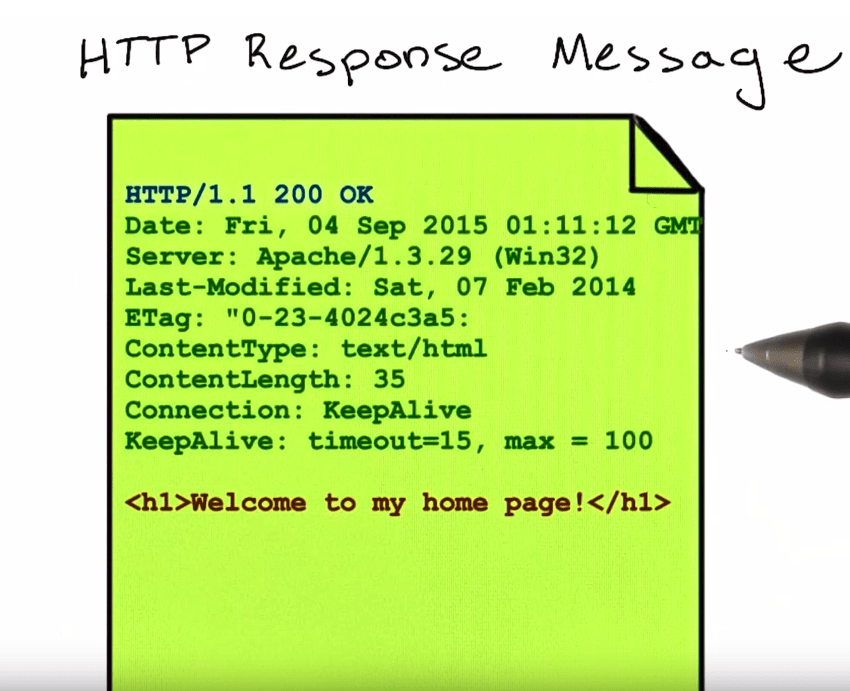
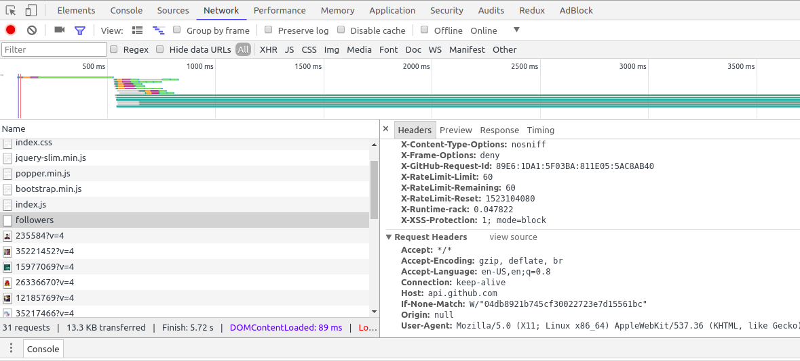
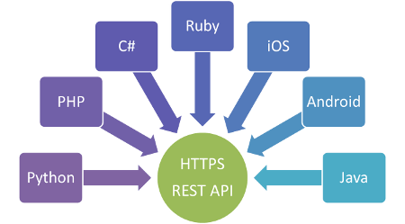

# API 1

---

- ▢ HTTP API & Protocol
  - HTTP/HTTPS
  - HTTP Request and Response
  - TCP/IP, OSI layer, network address
  - SSL/TLS: Let's Encrypt
- ▢ REST APIs
  - `GET`, `POST`, `PUT`, `DELETE`
  - AJAX/Fetch requests
  - REST vs SOAP vs GraphQL vs gRPC
- ▢ Web Services
  - Mailchimp, Google Forms
  - Twitter, Facebook, Instagram, Wikipedia
  - Google Maps, OpenStreetMap
  - Trello, Slack
- ▢ REST API Client
  - cURL or HTTPie
  - Postman or Insomnia
- ▢ Internet Trivia
  - FTP, telnet
  - Real-time protocols: WebSocket, WebRTC, Socket.io

---

## HTTP

HTTP is a protocol which allows the fetching of resources, such as HTML documents. It is the foundation of any data exchange on the Web and a client-server protocol, which means requests are initiated by the recipient, usually the Web browser.

### HTTP Communication Process



### HTTP Request Structure

- Request line: First line of HTTP Request, consist of HTTP Verb, URI, and HTTP version number.
- Header: Describe specific property of a request.
- Body: Additiaonal information about request.



### HTTP Response Structure

- Status line: First line of HTTP Response, consist of HTTP version, status code, and reason parse.
- Header : Optional response header.
- Body : Requested resource



### HTTP header

HTTP headers allow the client and the server to pass additional information with the request or the response. A request header consists of its case-insensitive name followed by a colon ':', then by its value (without line breaks). You can see it through you browser by using developer tools (Network tab).



### HTTP verbs

HTTP defines a set of request methods to indicate the desired action to be performed for a given resource.

**HTTP Verb & Description**

- `GET` = The GET method requests a representation of the specified resource. Requests using `GET` should only retrieve data.
- `POST` = The `POST` method is used to submit an entity to the specified resource, often causing a change in state or side effects on the server.
- `PUT` = The `PUT` method replaces all current representations of the target resource with the request payload.
- `DELETE` = The `DELETE` method deletes the specified resource.
- `CONNECT` = The `CONNECT` method establishes a tunnel to the server identified by the target resource.
- `OPTIONS` = The `OPTIONS` method is used to describe the communication options for the target resource.
- `HEAD` = The `HEAD` method asks for a response identical to that of a `GET` request, but without the response body.

---

## Restful APIs

### What is an API

Application Programming Interface (API) is a term for describing how a programs communicate and exchange data in certain format.

- [REST API Tutorial - What is a REST API? - YouTube](https://www.youtube.com/watch?v=BRdcRFvuqsE&list=PL4cUxeGkcC9jBcybHMTIia56aV21o2cZ8)

### What is REST

REpresentational State Transfer (REST) is a one of many architectural style of an API. A RESTful API is an application program interface (API) that uses HTTP requests (HTTP verbs) to GET, PUT, POST and DELETE data.



### Another API Architecture

- SOAP
- GraphQL
- gRPC

---

## Example of RESTful API designs

| Route                     | HTTP Verb | Description                  |
| ------------------------- | --------- | ---------------------------- |
| example.com/api/items     | `GET`     | Get all the items            |
| example.com/api/items/:id | `GET`     | Get a single item            |
| example.com/api/items     | `POST`    | Save an item                 |
| example.com/api/items     | `DELETE`  | Remove all the items         |
| example.com/api/items/:id | `DELETE`  | Remove an item               |
| example.com/api/items/:id | `PUT`     | Update an item with new info |

## Example of Github RESTful API

| Route                                         | HTTP Verb | Description             |
| --------------------------------------------- | --------- | ----------------------- |
| api.github.com/users                          | `GET`     | Get all users (limited) |
| api.github.com/users/muhammadhaekal           | `GET`     | Get a single user       |
| api.github.com/users/muhammadhaekal/followers | `GET`     | Get user followers      |
| api.github.com/users/muhammadhaekal/following | `GET`     | Get following users     |

## REST API Client

CLI:

cURL or HTTPie

GUI:

Postman or Insomnia

## Fetching data from API

The `fetch()` API provides a JavaScript interface for accessing and manipulating parts of the HTTP pipeline, such as requests and responses.

A request to api will return as a javascript response object. We can use `.json()` built in method to returns a promise that resolves with the result of parsing the body text as JSON.

example:

```js
fetch("https://api.github.com/users/username")
  .then(response => {
    return response.json()
  })
  .then(data => {
    console.log(data)
  })
```

---

### Websocket

WebSockets are an advanced technology that makes it possible to open an interactive communication session between the user's browser and a server. With this API, you can send messages to a server and receive event-driven responses without having to poll the server for a reply.

## References

- [Understanding And Using REST APIs — Smashing Magazine](https://www.smashingmagazine.com/2018/01/understanding-using-rest-api)
- [HTTP Status Codes](https://httpstatuses.com)
- [Learn REST | A RESTful Tutorial | REST API Tutorial](http://www.restapitutorial.com)
- https://scotch.io/tutorials/how-to-use-the-javascript-fetch-api-to-get-data
- https://developer.mozilla.org/en-US/docs/Web/API/Fetch_API/Using_Fetch
- [Best Practices for Designing a Pragmatic RESTful API | Vinay Sahni](https://www.vinaysahni.com/best-practices-for-a-pragmatic-restful-api)
- [API Glossary & Acronyms](http://apiglossary.com)
- [HTTP API Design Guide](https://geemus.gitbooks.io/http-api-design/content/en)
- [`lambda2/rapis`: A specification proposal for API's](https://github.com/lambda2/rapis)
- [GraphQL vs. REST – Apollo GraphQL](https://dev-blog.apollodata.com/graphql-vs-rest-5d425123e34b)
- [Parts of HTTP Request - Udemy](https://www.youtube.com/watch?v=pHFWGN-upGM)
- [Websocket - Mozilla Developer Network](https://developer.mozilla.org/en-US/docs/Web/API/WebSockets_API)

---

# Web Services

- Mailchimp, Google Forms
- Twitter, Facebook, Instagram, Wikipedia
- Google Maps, OpenStreetMap
- Trello, Slack

---

# Internet Trivia

FTP, telnet

Real-time protocols:

- WebSocket
- Socket.io
- WebRTC

---

# API Project 1

- [API Project 1](../../modules/api-project-1/README.md)
