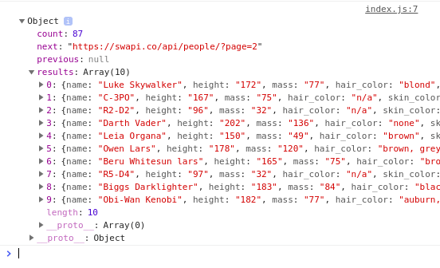
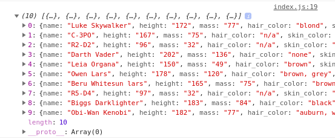
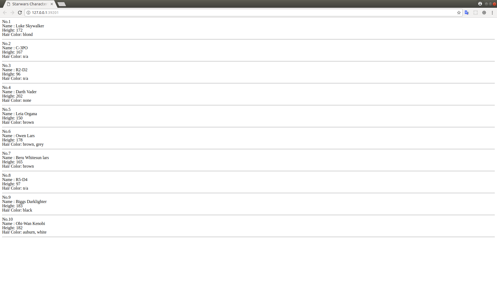
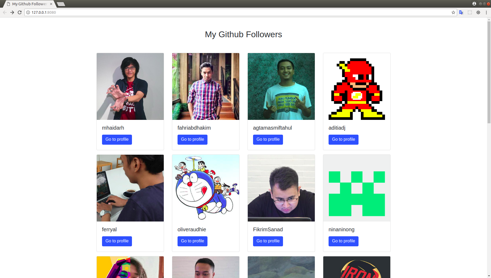

# API Project 1

---

## Requirements

Write a simple website to get and manipulate data from Star Wars API. (https://swapi.co).

### Process

Use `fetch` to get data from the API and display it to your browser.

---

## Level 0

Based on documentation, perform a request to endpoint for getting all people resource. After that, log the response into the browser's console.

Expected browser's console output:

---

## Level 1

Inside that response, get an array result that contains a Star Wars characters and logs it into browser's console.

Expected browser's console output:

---

## Level 2

Using DOM `document.getElementById()` , DOM `innerHTML` and Array `map()`, display the result through HTML.

Expected output:

## Level 3

Based on documentation (https://developer.github.com/v3/users/followers/), perform a request to endpoint for getting the list of your followers. After that, display the follower's list using bootstrap `grid layout` and `card` component.

