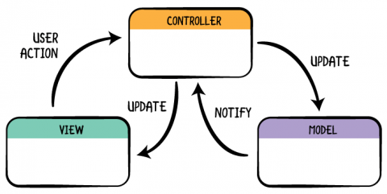
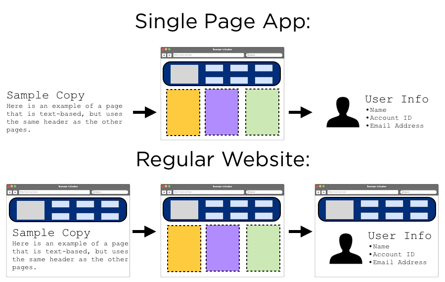

# Architecture 1

---

## Introduction

Architecture is the decisions you make about your application.

---

## Separation of Concerns

Application consists of separate components with different responsibilities.

Because of this separation of concerns, we can very easily change one component without affecting the rest of the application as there is a loose coupling between the components.

---

## Model View Controller (MVC)

---

## Single Page Application (SPA)

