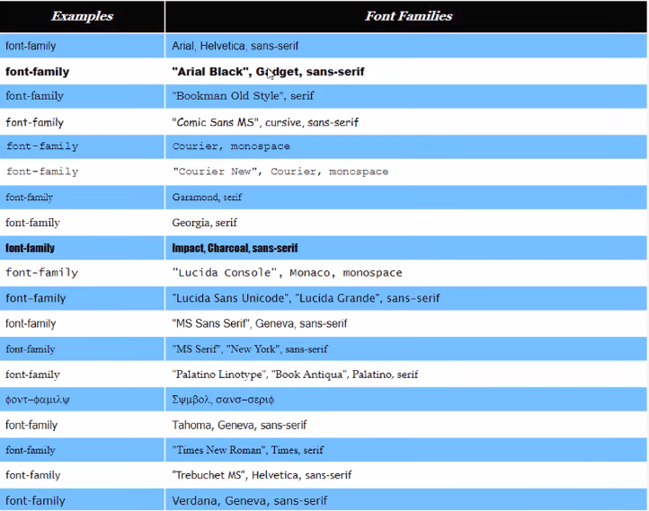
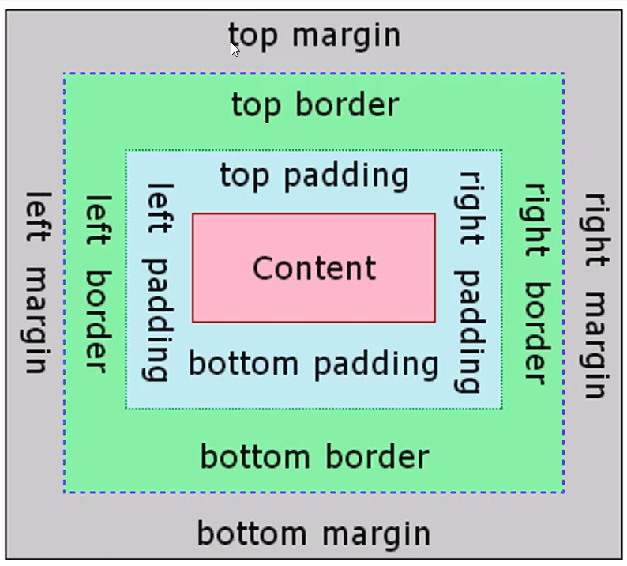

# CSS 1

---

## What is CSS (Cascading Style Sheet)

_**Imagine that if HTML is skeleton of the Website, then the CSS is a skin of the Website.**_

CSS is a way to style HTML page. Usually have `.css` file extension. It only structures the style, not the content or functionality. That's why CSS can only works when we have HTML.

---

## CSS Syntax

```css
/* A CSS syntax */
selector {
  property: value;
}
```

- selector: defines targeted html element/elements
- property: defines property to alter
- value: defines value of css property

Example :

```html
<h1>To Do list</h1>
```

```css
h1 {
  color: red;
}
```

---

## HTML + CSS

There are four ways to use CSS into HTML.

### Inside HTML tag (Not Recomended!)

```html
<head>
  <title style="color:blue;">Website</title>
</head>
```

### `style` HTML tag

HTML:

```html
<head>
  <title>Website</title>
  <style>
    /* CSS code here */
    selector {
      property: value;
    }
  </style>
</head>
```

### `link` HTML tag

HTML:

```html
<link rel="stylesheet" href="./index.css">
```

CSS:

```css
/* CSS code here */
selector {
  property: value;
}
```

### `@import` CSS declaration

CSS:

```css
@import url("./other.css");

/* CSS code here */
```

---

## CSS Selectors

CSS selectors define which HTML elements we want our styling to be applied to. There are many ways of targeting HTML elements using CSS selector.

**1. Using Tag Selector**

```css
a {
  /* Links */
}
p {
  /* Paragraphs */
}
ul {
  /* Unordered lists */
}
li {
  /* List items */
}
```

**2. Using Class Selector**

```html
<p class="date">
  Saturday Feb 21
</p>
```

```css
.date {
  /* Elements with date class */
}
```

**3. Using ID Selector**

```html
<h1 id="tagline">This heading will be orange.</h1>
```

```css
#tagline {
  /* Elements with tagline id */
}
```

**4. Multiple elements**

```css
p,
a,
.date {
  /* Paragraphs ,Links and date Class */
}
```

**5. Child Element**

```html
<p>
  <a>link</a>
</p>
```

```css
p a {
  /* Links inside Paragraph*/
}
```

---

## CSS Web Safe Fonts

The font-family property should hold several font names as a "fallback" system, to ensure maximum compatibility between browsers/operating systems. **If the browser does not support the first font, it tries the next font**.

Start with the font you want, and end with a generic family, to let the **browser pick a similar font in the generic family**, **if no other fonts are available**

```CSS
p  {
  font-family: "Lucida Console", monaco, monospace;
}
```

Example:



---

## CSS Color Units

Color in CSS can be in various format like its name, hex code, RGB, and HSL.

```css
.class {
  color: white; /* name */
  color: #ffffff; /* hex */
  color: #fff; /* hex */
  color: rgb(255, 255, 255); /* rgb */
  color: hsl(0, 0%, 100%); /* hsl */
}
```

---

## CSS Size Units

We can specify the `width` and `height` of the element using various format like pixel, percetage, or em.

```css
.class {
  width: 200px;
  height: 20%;
  margin: 2em;
}
```

---

## CSS Box Model

All HTML elements can be considered as boxes. In CSS, the term "box model" is used when talking about design and layout.



- Content - The content of the box, where text, images, or **another element**
- Padding - Clears an area around the content. The padding is transparent
- Border - A border that goes around the padding and content
- Margin - Clears an area outside the border. The margin is transparent

### CSS Background

The background of an HTML element is what appears behind the text. We can set an image or a color to be a background of the HTML element.

```css
#example {
  background-color: blue;
  background-image: url(./images/impactbyte.png);
  background-repeat: no-repeat;
  background-attachment: fixed;
  background-position: left bottom;
}
```

### CSS Display

CSS display properties can change display type of the HTML element. For example `<p>` element display default type is block and `<span>` display default type is inline. With display properties we can change `<span>` default type to be block.

Each display options have specific rendering behaviors:

- **block** : Will take up the whole width available.
- **inline** : Will take up the width just as text width (will ignore `width`, top/bottom `margin`,and top/bottom `padding`).
- **inline-block** : Simmilar to inline but we can set `width` , top/bottom `margin`,and top/bottom `padding`.

```css
#example1 {
  display: block;
}

#example2 {
  display: inline;
}

#example3 {
  display: inline-block;
}
```

### CSS Height and Width

With height and width properties we can set the height and width of an element.

```css
#example {
  width: 50%;
  height: 200px;
}
```

And if the content inside the element larger than element itself, we can use CSS overflow

```css
#example {
  overflow: hidden; /* auto | scroll */
}
```

### CSS Border

HTML element rendered as rectangle. So it has 4 possible sides:

- `border-top`
- `border-bottom`
- `border-left`
- `border-right`

and has many properties :

- `border-color` : defined by using a color unit
- `border-style` : can be solid, dashed, dotted…
- `border-width` : defined by using a size unit

```css
#example1 {
  border-color: blue; /* Color Units */
  border-style: solid; /* none | dotted | dashed | groove | etc ... */
  border-width: 3px; /* Size Units */
  border-radius 50%; /* rounded element */
}

/* Custom specific side of border*/
#example2 {
  border-bottom-color: blue; /* Color Units */
  border-bottom-style: solid; /* none | dotted | dashed | groove | etc ... */
  border-bottom-width: 3px; /* Size Units */
}
```

---

## CSS Margin & Padding

Padding is space between content and border and Margin is space between border and another element. And because all html elements redered as rectagle, both Padding and Margin has 4 possible sides (top,bottom,left,right).

```css
/* set all sides of margin and padding */
#example1 {
  padding: 20px;
  margin: 20px;
}

/* set specific side */
#example2 {
  margin-top: 20px;
  margin-left: 20px;
  padding-top: 100px;
}
```

---

## CSS Size Shorthand Wheel

There is another way to specify Padding and Margin.

```css
#example1 {
  padding: 20px 0 10px 5px; /* the order is top,right,bottom, and left*/
}

#example {
  padding: 20px 0; /* Padding top and bottom 20px, Padding left and right 0 */
}
```

---

## CSS Position

With CSS `position` we can alter an element position. It has 4 possible value:

- Static : Default value of position properties, They aren’t affected by any left, right, top or bottom value.
- Relative : Move element according to current position, without affecting another element.
- Absolute : When the position is set to absolute, an element can move according to the first positioned ancestor.
- Fixed : Move element according to browser window.

With 4 coordinates properties:

- Left
- Right
- Top
- Bottom

```css
/* Position relative example */
#relative-example {
  position: relative;
  border-color: red;
  left: 20px;
  top: 10px;
}

/* Position absolute example */
#relative-div {
  background: gold;
  height: 200px;
  padding: 10px;
  position: relative; /* This turns the #relative-div into a point of reference for the #absolute-div */
}

#absolute-div {
  background: limegreen;
  color: white;
  padding: 10px;
  position: absolute; /* This makes the #absolute-div freely movable */
  bottom: 10px; /* 10px from the bottom */
  left: 20px; /* 20px from the left */
}

/* Position fixed example*/
#fixed-example {
  position: fixed;
  left: 100px;
  top: 150px;
}
```

---

## CSS Pseudo Classes

Pseudo Classes is attached to selector. The pseudo-class will only define a particular state of that selector.

Some of popular Pseudo Classes are:

- :hover
- :visited

example:

```css
/* :hover example */
#example1 {
  color: blue;
}

#example1:hover {
  color: red;
}

/* :visited example */
a {
  color: blue;
}
a:visited {
  color: red;
}

/* :focus example */
.form-input {
  border: 2px solid grey;
  padding: 5px;
}
.form-input:focus {
  background: lightyellow;
  border-color: blue;
  outline: none;
}
```

---

## CSS Responsiveness with Media Query


Media queries are useful when you want to modify your site or app depending on a device's general type (such as print vs. screen) or specific characteristics and parameters (such as screen resolution or browser viewport width).

Media queries are used for the following:

- To conditionally apply styles with the CSS `@media` and `@import` at-rules.
- To target specific media for the `<link>`, `<source>`, and other HTML elements.

```
@media (hover: hover) { ... }
```

```
@media (max-width: 12450px) { ... }
```

https://developer.mozilla.org/en-US/docs/Web/CSS/Media_Queries/Using_media_queries

---

## CSS Style Guide

To assure our CSS quality, we can use a free tool called [csslint](http://csslint.net).

---

## References

- https://codecademy.com/learn/learn-css
- https://marksheet.io/css-basics.html
- https://learn.shayhowe.com/html-css/getting-to-know-css
- https://w3schools.com/css/default.asp
