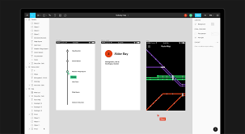
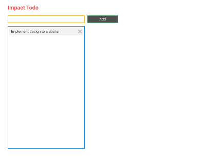

# Design 1

---

## UI (User Interface) Design

---

## Wireframe vs Mockup vs Prototype

Commonly when designing a website or application, we are recommended to visualize it first.

Wireframing is the easiest design method to create just the essentials. Plan out the content, positioning, and more.

Mockup is the bare minimum of the design. We can see better layout, colors, typography, images, and more.

Prototype is often the advanced one where we can make the mockup interactively used. Without having to code it.

Now [here's an example](https://www.figma.com/proto/ID5EGTB6c4ARMn2CwfRe3AL1/Mockup-v1) of an interactive prototype of the app we're building. You can play around by clicking the highlighted areas: input box, add button, and delete button.

---

## Design Tool

Nowadays, we can just use online design tool to create a mockup or graphic design. Let's use [Figma](https://figma.com) for a start, and follow along with the predefined design wireframe/mockup for our app.
