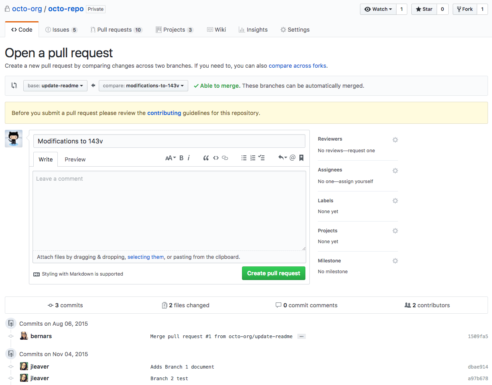

# GitHub 2

---

## GitHub Flow with Pull/Merge Request

In GitHub, collaboration is often done by these flows that involve pull request.

[](https://help.github.com/articles/about-pull-requests)

### Single Repository

[](https://guides.github.com/introduction/flow)

1.  Clone the repo, then create a `branch`
2.  Add commits to that created `branch`
3.  Push the `branch` from `local` to `remote`
4.  Open a pull request, from that `branch` to `master`
5.  Discuss and review your code with peers
6.  Deploy the `branch` for testing purpose
7.  Merge the `branch` into `master`

### Forked Repository

[](https://guides.github.com/activities/forking)

Forking is process where your contribute to someone else’s project or use someone’s project as the starting point for your own. Forking a repository allows you to freely experiment with changes without affecting the original project. The fork itself is a copy of a repository.

Remember that this _fork_ terminology is mostly happen inside Git platforms like GitHub, GitLab, or Bitbucket.

1.  Fork a repository, then clone the repo
2.  Add commits to that the `master` branch of forked repository
3.  Push the changes from `local` to `remote`
4.  Open a pull request, from forked `master` to original `master`
5.  Discuss and review your code with peers
6.  Deploy the fork for testing purpose
7.  Merge the fork into the original repo

Keep in mind that in this way, you will have at least two remotes. The fork is now the `origin`, and the original is the `upstream`.

```sh
$ git remote -v

origin    https://github.com/YOUR_USERNAME/YOUR_FORK.git (fetch)
origin    https://github.com/YOUR_USERNAME/YOUR_FORK.git (push)
upstream  https://github.com/ORIGINAL_OWNER/ORIGINAL_REPOSITORY.git (fetch)
upstream  https://github.com/ORIGINAL_OWNER/ORIGINAL_REPOSITORY.git (push)
```

---

## References

* [Understanding the GitHub Flow - GitHub Guides](https://guides.github.com/introduction/flow)
* [About pull requests - GitHub User Documentation](https://help.github.com/articles/about-pull-requests)
* [Forking Projects - GitHub Guides](https://guides.github.com/activities/forking)
* [Fork A Repo - GitHub User Documentation](https://help.github.com/articles/fork-a-repo)
