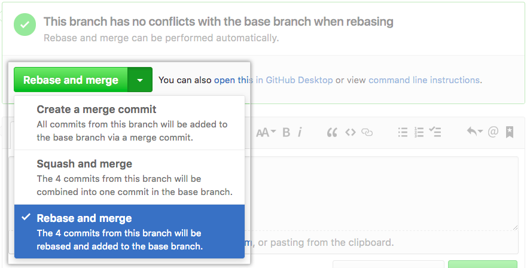

# GitHub 2

## Collaboration: pull/merge request

Merge request(GitLab) or pull requests (GitHub) are created in a git management application and ask an assigned person to merge two branches.

Pull requests let you tell others about changes you've pushed to a repository on GitHub. Once a pull request is opened, you can discuss and review the potential changes with collaborators and add follow-up commits before the changes are merged into the repository.

## Creating pull request (Github)

There are 2 main work flows when dealing with pull requests:

1.  Pull request from branch within a repository.
1.  Pull request from a forked repository.

## Pull request from branch within a repository

* Get the latest commit on master.

```
git pull origin master
```

* Create a new branch from the latest commit on master and checkout to new branch.

```
git checkout -b pull-request-demo
```

* Make change to your new branch. Then, commit and push your chage.

```
git add
git commit -m "[commit message]"
git push origin pull-request-demo
```

* In the "Branch" menu, choose the branch that contains your commits.

  

* To the right of the Branch menu, click New pull request.

  

* Use the base branch dropdown menu to select the branch you'd like to merge your changes into, then use the compare branch drop-down menu to choose the topic branch you made your changes in.

  

* Type a title and description for your pull request.

  

* Click Create pull request.

  

## Pull request from a forked repository.

* Fork the project, clone your fork, and configure the remotes.

```
git clone https://github.com/<your-username>/<repo>.git
cd pcl
git remote add upstream https://github.com/<source-username>/<repo>.git
```

* Get latest changes from upstream

```
git checkout master
git pull upstream master
```

* Create a new branch from the latest commit on master and checkout to new branch.

```
git checkout -b pull-request-demo
```

* Make change to your new branch. Then, commit and push your chage.

```
git add
git commit -m "[commit message]"
git push origin pull-request-demo
```

* Go to GitHub original source repo (not forked repo), click New pull request.

  

* Confirm that the base fork is the repository you'd like to merge changes into. Use the base branch drop-down menu to select the branch of the upstream repository you'd like to merge changes into.

* Use the head fork drop-down menu to select your fork, then use the compare branch drop-down menu to select the branch you made your changes in.

  

* Type a title and description for your pull request.

  

* Click Create pull request.

  

## Merging pull request

* Under your repository name, click Pull requests.

  

* In the "Pull Requests" list, click the pull request you'd like to merge.

* Depending on the merge options enabled for your repository, you can:

  * Merge all of the commits into the base branch

    

  * Squash the commits into one commit

    

  * Rebase the commits individually onto the base branch

    
