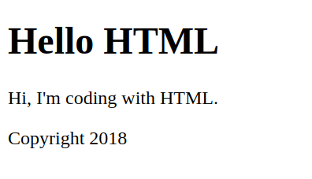
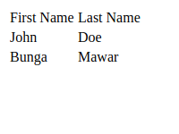
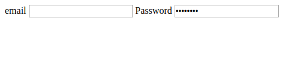
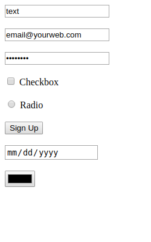
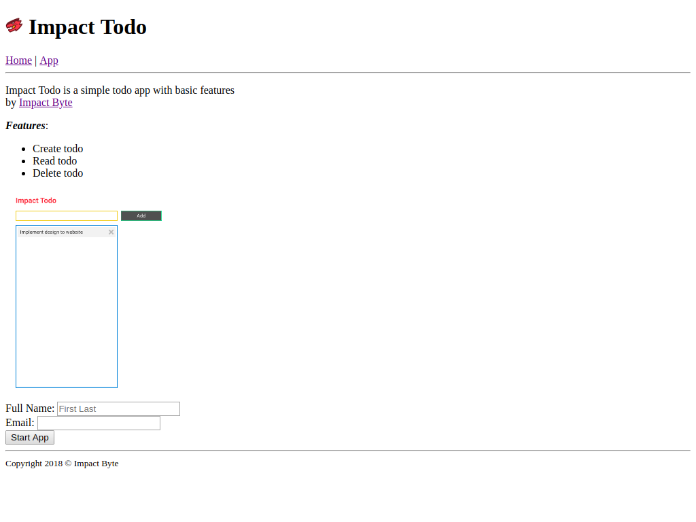
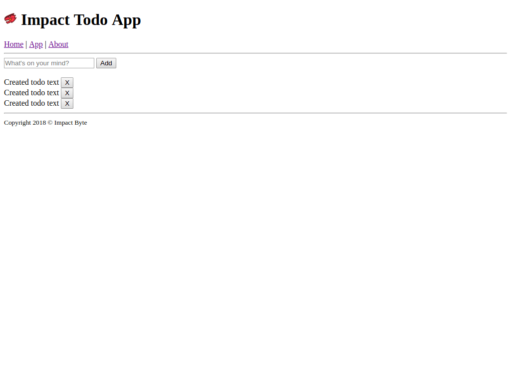

# HTML 1

---

## HTML (HyperText Markup Language)

HTML is the main building blocks of a website.

Usually have `.html` file extension.

It structures the content, but not the style or functionality.

That's why later we will need CSS and JavaScript.

### Tag

An HTML `tag`/`element` is declared like:

```html
<tag>text</tag>
```

With the opening tag and closing tag, containing the text content.

### Elements

There are various HTML elements based on our intention or usage on the web page:

* For segmenting the web page: `doctype`, `html`, `head`, `body`
* For meta data: `title`, `meta`
* For text: `h1`-`h7`, `p`, `a`, `span`, `b`, `i`, `strong`, `em`
* For visualizing: `img`, `button`
* For dividing content: `div`, `main`, `section`, `article`, `aside`, `header`, `footer`, `nav`
* For listing things: `ul`, `ol`, `dl`, `li`
* For creating a table: `table`, `thead`, `tbody`, `tr`, `td`
* For multimedia: `video`, `audio`, `iframe`
* For form inputs: `form`, `label`, `input`, `fieldset`, `textarea`, `required`, `autofocus`, `contenteditable`
* For commenting: `<!-- comment -->`

You don't need to remember them all. Just use when you need it.

---

## Hello HTML

To create an HTML page, create an `index.html` or `hello.html` file in your editor. Then:

1.  Segment the page
2.  Fill with meta data
3.  Fill with content, text, or image

**Code:**

```html
<!DOCTYPE html> <!-- define the HTML version -->
<html> <!-- the actual HTML page -->

<!-- the head part, mostly containing metadata -->
<head>
  <title>Hello HTML</title>
</head> <!-- close the head part -->

<!-- the body part, containing the content -->
<body>
  <div>
    <!-- Header part -->
    <header>
      <h1>Hello HTML</h1>
    </header>

    <!-- Main content -->
    <main>
      Hi, I'm coding with HTML.
    </main>

    <!-- Footer part -->
    <footer>
      <small>Copyright 2018</small>
    </footer>
  </div>
</body> <!-- close the body part -->

</html> <!-- close the html page -->
```

Bear in mind of the placement of each elements after elements.

**Result:**



---

## HTML Style Guide

Keep in mind your usage of indentation, capitalization, white space; as they will help your code to be readable.

Visi [this Google's style guide](https://google.github.io/styleguide/htmlcssguide.html) as a reference.

---

## HTML Attribute

HTML attribute provide additional information about an element and specified in the start tag.


Example:

```html

```

output :


---

## ID and Class in HTML Tags

Each HTML tag can be assigned with `id` or `class`.

`id` is unique, only use one `id` in a single tag.

`class` can be more than one, will be used for styling purpose.

`id` only:

```html
<h1 id="title">
  Website Title
</h1>
```

`class` only:

```html
<h1 class="blue">
  Website Title
</h1>
```

multiple `class`:

```html
<h1 class="cool blue">
  Website Title
</h1>
```

combined:

```html
<h1 id="title" class="cool blue">
  Website Title
</h1>
```

---

## Block Vs Inline Elements

* Block Elements: `<ul>`, `<ol>`, `<h1> - <h6>`, `<div>`, `<article>`
* Inline Elements: `<1>`, `<em>`, `<strong>`

Block elements are meant to structure the main parts of your page, by dividing your content in coherent blocks.

Inline elements are meant to differentiate part of a text, to give it a particular function or meaning. Inline elements usually comprise a single or few words.

```html
<article>
  <h1>Famous football quotes</h1>

    Sir <strong>Alex Ferguson</strong> once said about Filipo Inzaghi:<q>That lad must have been born offside</q>.


    When criticized by John Carew, <strong>Zlatan Ibrahimovic</strong> replied: <q>What Carew does with a football, I can do with an orange</q>.


    <strong>George Best</strong> said <q>"I spent a lot of money on booze, birds and fast cars. The rest I just squandered."</q> when asked about his lifestyle.

</article>
```


---

## HTML table

* Start with `<table>`
* Add rows with `<tr>`
* Add regular cells with `<td>` or heading cells with `<th>`

```html
<table>
  <tr>
    <td>First Name</td>
    <td>Last Name</td>
  </tr>
  <tr>
    <td>John</td>
    <td>Doe</td>
  </tr>
  <tr>
    <td>Bunga</td>
    <td>Mawar</td>
  </tr>
</table>
```




* Using `<thead>`, `<tfoot>` and `<tbody>`

```html
<table>
  <thead>
    <tr>
      <th>First Name</th>
      <th>Last Name</th>
    </tr>
  </thead>
  <tfoot>
    <tr>
      <th>First Name</th>
      <th>Last Name</th>
    </tr>
  </tfoot>
  <tbody>
    <tr>
      <td>John</td>
      <td>Doe</td>
    </tr>
    <tr>
      <td>Bunga</td>
      <td>Mawar</td>
    </tr>
    <tr>
      <td>Bunga</td>
      <td>Melati</td>
    </tr>
  </tbody>
</table>
```


---

## HTML forms

* Start with `<form>`
* Put all form controls tag inside `<form>` tag : `<input>`, `<label>`, `<button>`, `<option>`, `<select>`, `<textarea>`, etc ..
* All user input will be stored in the `value` attribute

```html
<form>
  <label for="email">email</label>
  <input id="email" type="email">

  <label for="password">Password</label>
  <input id="password" type="password">
</form>
```



### HTML input tag

* html input tag has no end tag
* html input tag has many type attribute options like `button`,`checkbox`, `color`, `email`, `password`, `text`, `radio`, `date`, `time`
* always specify `name attribute` at every input element


```html
<input type="text" name="text" value="text">
<input type="email" name="email" value="email@yourweb.com">
<input type="password" name="password" value="password">
<input type="checkbox" name="checkbox"> Checkbox 
<input type="radio" name="radio"> Radio 
<input type="button" name="button" value="Sign Up">
<input type="date" name="date">
<input type="color" name="color">
```



---

## File path

| Path                              | Description                                                                |
| --------------------------------- | :------------------------------------------------------------------------- |
| ``         | picture.jpg is located in the same folder as the current page              |
| ``  | picture.jpg is located in the images folder in the current folder          |
| `` | picture.jpg is located in the images folder at the root of the current web |
| ``      | picture.jpg is located in the folder one level up from the current folder  |

---

## Example

**Source Code:**

[`index.html`](./code/app/index.html)

**Screenshot:**



**Source Code:**

[`app.html`](./code/app/app.html)

**Screenshot:**



---

## Deployment or Upload to the Internet

Use [Netlify](https://netlify.com) to upload your built website for free and fast.

You will get a free customizable subdomain like <https://yourname-project.netlify.com>

---

## References

* [HTML Basics - Free tutorial to learn HTML and CSS](https://marksheet.io/html-basics.html)
* [Getting to Know HTML - Learn to Code HTML & CSS](https://learn.shayhowe.com/html-css/getting-to-know-html)
