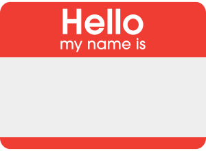
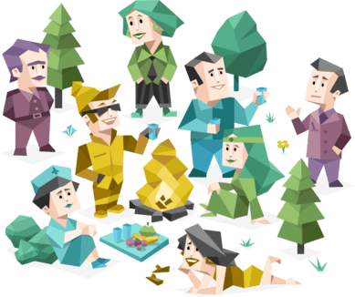

# Introduction

---

## Introduce Ourselves

Let's introduce ourselves to the rest of the class.

Who are you? Your name, origin, and age if you prefer.

Why are you deciding to learn to code? Explain some of your ideas.

What are you working on in your previous current career or job?

What's your hobby or life goals? Do you know [why you're exist](https://startwithwhy.com) in this world?

Why did you choose Impact Byte to help you?

Let's discuss this interesting matters together!

---

## Impact Byte Ecosystem

In Impact Byte, we're building a special ecosystem for you.

Our team is diversed and working in various areas and industries, from various locations (some are remotes!)

Meanwhile, our Impact Byte Network gather [various partners](https://impactbyte.com/partners)

* [Impact Byte Team](https://impactbyte.com/team)
* [Impact Byte Network + Partners](https://impactbyte.com/partners)
* Impact Byte World
* Venue Tour
* Photo Shoot

Let's have some photo shoots after this!

---

## Personality and Mindset

Do you have existing profile you want to share? Like on the Internet, social media such Facebook, Twitter, Instagram, YouTube, etc.

Based on what you're thinking or aiming right now, do you intend to be a developer expert, regular coder, or nothing related to tech (but just want to learn)?

There's a site called [16 Personalities](https://16personalities.com) that can help you know what's your common personality traits. And there are [16 of them](https://16personalities.com/personality-types)! Please [take the test](https://16personalities.com/free-personality-test) to discover. Here's an [example result profile](https://16personalities.com/profiles/56b7dcfe3ca70).

Do you know if you're more into right or left brained? This can help you determine your best potential talent, either logical or creative person.

### References

* [How to think like a programmer — lessons in problem solving](https://medium.freecodecamp.org/how-to-think-like-a-programmer-lessons-in-problem-solving-d1d8bf1de7d2)
