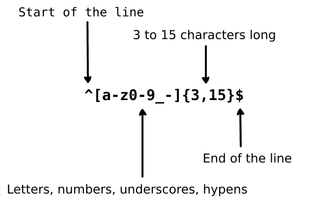

# JavaScript 8

---

## Pattern Matching & Regular Expression

Pattern Matching in programming is often associated with Regular Expression (regex).

Regular expression is a group of characters or symbols which is used to find a specific pattern from a text.

A regular expression is a pattern that is matched against a subject string from left to right. The word "Regular expression" is a mouthful, you will usually find the term abbreviated as "regex" or "regexp".

Regex is used for:

- Replacing a text within a string
- Validating form input fields
- Extracting a substring from a string based upon a pattern match
- Checking a text format like phone number, email address, zip code, etc

Imagine you are writing an application and you want to set the rules for when a user chooses their username. We want to allow the username to contain letters, numbers, underscores and hyphens. We also want to limit the number of characters in username so it does not look ugly. We use the following regular expression to validate a username:



Above regular expression can accept the strings `john_doe`, `jo-hn_doe`, and `john12_as`. It does not match `Jo` because that string contains uppercase letter and also it is too short.

In JavaScript, there are built-in regex methods: `test`, `replace`, `match`, `search`.

For example, here's for checking if a string is a valid email:

```js
const pattern = /^[^\s@]+@[^\s@]+\.[^\s@]+$/

const email1 = 'yourname@domain.com'
const result1 = pattern.test(email1)
console.log(result1) // true

const email2 = 'yourname!domain!com'
const result2 = pattern.test(email2)
console.log(result2) // false
```

---

## References

- Guide
  - [Learn regex the easy way](https://github.com/zeeshanu/learn-regex)
  - [RegexOne - Learn Regular Expressions with simple, interactive exercises](https://regexone.com)
- Tools
  - [RegExr - Learn, Build, & Test RegEx](https://regexr.com)
  - [Debuggex - Online visual regex tester. JavaScript, Python, and PCRE](https://www.debuggex.com)
  - [Regex101 - Online regex tester and debugger: PHP, PCRE, Python, Golang and JavaScript](https://regex101.com)
- Documentation
  - [RegExp - JavaScript - MDN](https://developer.mozilla.org/en-US/docs/Web/JavaScript/Reference/Global_Objects/RegExp)
  - [How to Find or Validate an Email Address](https://www.regular-expressions.info/email.html)
  - [Collection of Email Address Regular Expression That 99.99% Works](http://emailregex.com)
  - [You Don't Know JS (book series)](https://github.com/getify/You-Dont-Know-JS)
