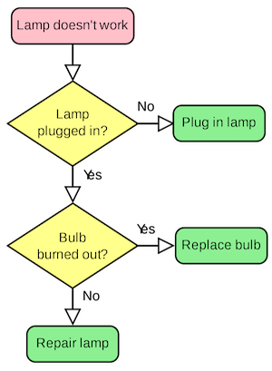

# Logic Flow

---

## How would you do things?

Let's evaluate on how we think and do things in the real world.

For example, how would you do these activities?

* Walking to your school
* Cooking a lunch meal
* Fixing a broken thing

Remember that in anywhere, you are getting paid to solve problems using your logic and collective team discussion. Coding is just the tool you use to solve them.

---

## Flowchart

A flowchart is a type of diagram that represents an algorithm, workflow or process. The flowchart shows the steps as boxes of various kinds, and their order by connecting the boxes with arrows. This diagrammatic representation illustrates a solution model to a given problem.

---

## Pseudocode

Pseudocode is an informal high-level description of the operating principle of a computer program or other algorithm. It uses the structural conventions of a normal programming language, but is intended for human reading rather than machine reading.

---

## Algorithm

Algorithm is a process or set of rules to be followed in calculations or other problem-solving operations, especially by a computer.

Commonly, we can illustrate the flow of an algorithm using flowchart & pseudocode.

---

## Action

Let's try to create an algorithm with flowchart & pseudocode!

We can implement the algorithm using programming language later on with JavaScript.

---

## References

- [Intro to Algorithms: Crash Course Computer Science #13 on YouTube](https://www.youtube.com/watch?v=rL8X2mlNHPM)
- [Algorithm : Pseudocode and Flowchart](https://www.youtube.com/watch?v=67AKFObATxQ)
- [What is Algorithm, Flowchart, and Pseudocode in planning programs before writing? - Quora](https://www.quora.com/What-is-Algorithm-Flowchart-and-Pseudocode-in-planning-programs-before-writing)
- [Algorithms in plain English: time complexity and Big-O notation](https://medium.freecodecamp.org/time-is-complex-but-priceless-f0abd015063c)
- [Hard Coding Concepts Explained with Simple Real-life Analogies](https://medium.freecodecamp.org/hard-coding-concepts-explained-with-simple-real-life-analogies-280635e98e37)