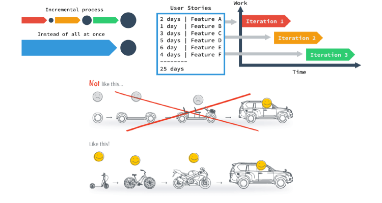

# Management 1

---

## Project/Product Management

Project/Product management in programming is often called Software Development Life Cycle (SDLC).

---

## Key Steps

- ideation
- wireframe/mockup
- data modeling
- list of backlog or user stories
- implementation
- bug fixing
- deployment release

---

## Methodology

- Waterfall
- Agile
- Scrum
- Kanban
- Lean

- Agile Principles
  - Scrum Framework
  - Kanban Methodology

---

## Tools

- GitHub Projects
- Trello
- Asana
- Airtable
