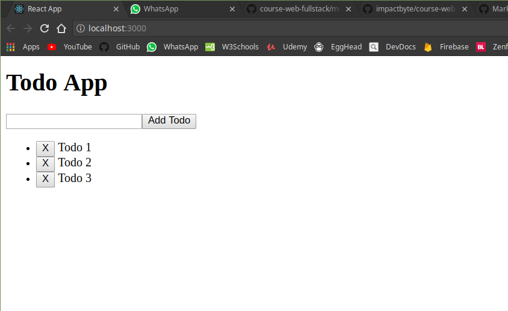

# ReactJS Project 1

## Todo App

## Requirements

Make a simple todo list app with create, read, update, delete (CRUD) features

---

## Level 1

Create simple ui component in your react project with list of todo, Input form, and a submit button. You can also add your own css styles to make it look better

---

## Level 2

Add a dummy data to the state and loop it to the list

---

## Level 3

Now, make the submit button clickable, so now you can add todo form your input to the state

---

## Level 4

Make the todo item in your list is deleteable and editable

---
