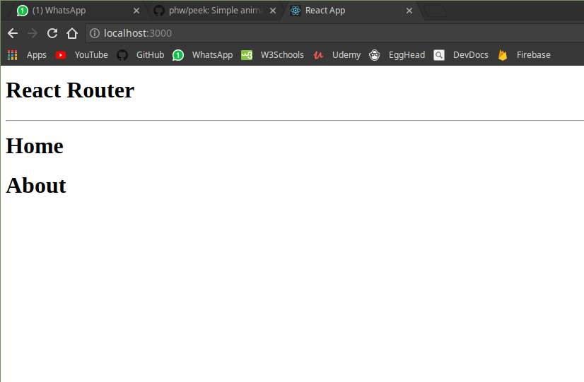
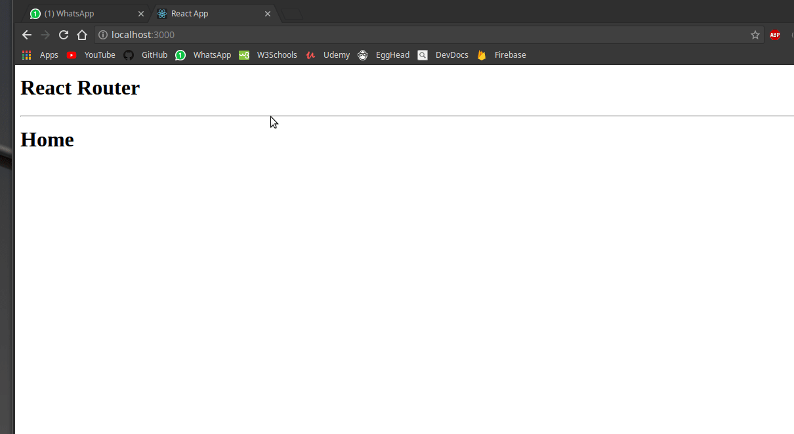
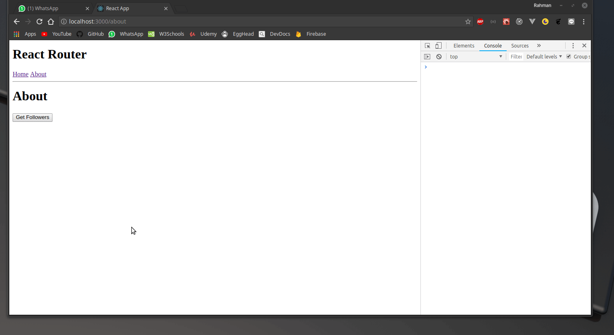
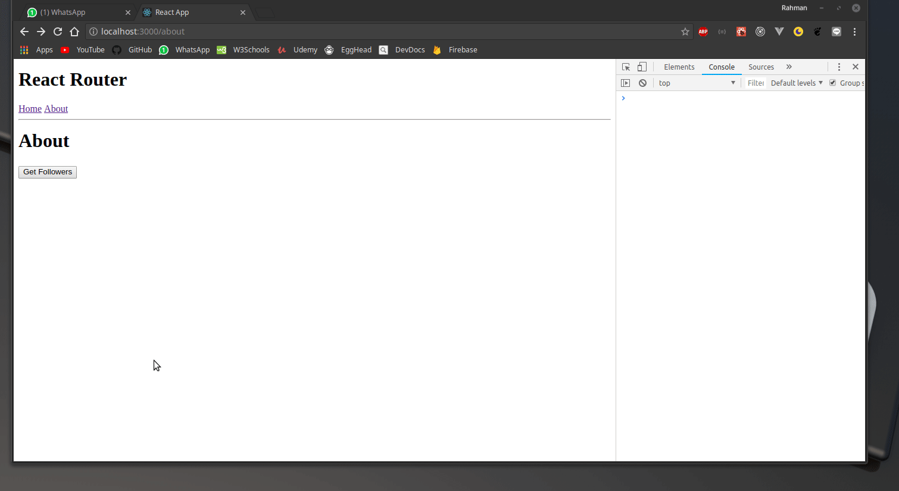

# ReactJS Project 2

## React Router

## Requirements

Create 2 components in your react app. First, the home component, here you can put images, texts, or something else else. Second, the about component, remember about fetch api that we have learned? Now i want you to fetch data of your github followers and display it on the about page.

---

## 1. Create Home and About

## 2. Create the `/` and `/about` route

## 3. Create the link to navigate between pages

## 4. Create the `Get Followers` button to fetch data from github api

## 5. Create the list of your followers and display the data

