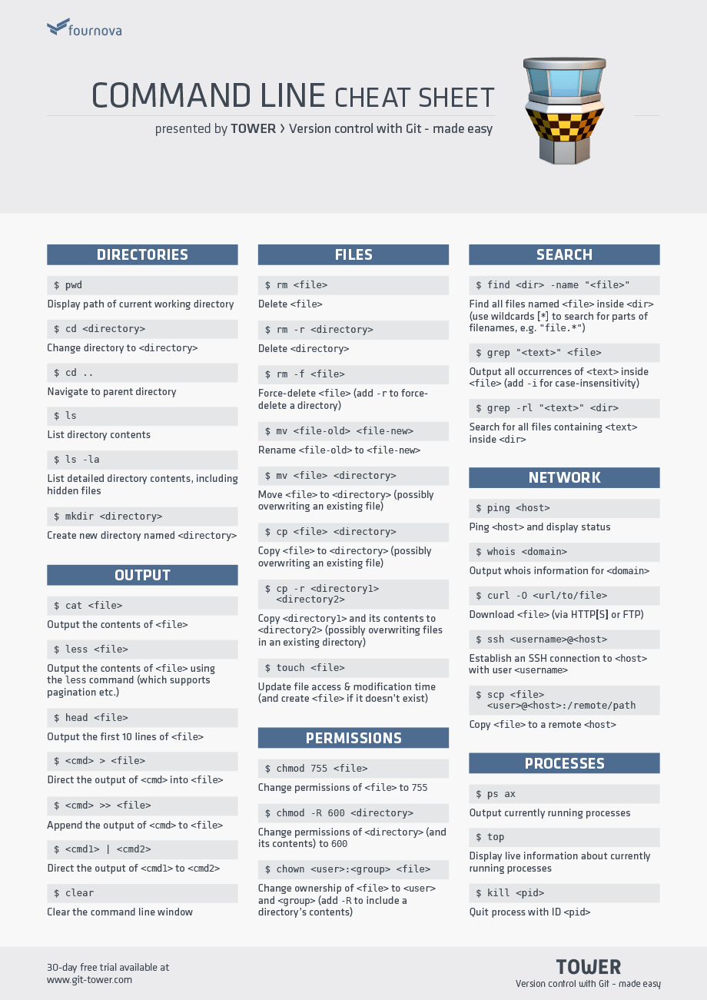

# Terminal 1

---

## Terminal/CLI (Command Line Interface)

Terminal is using CLI to interact with.

In Linux Ubuntu, We can use built in terminal called "Terminal".

In Mac, there's a built in one, but it's recommended to use "iTerm2". Get help from our mentor for installation.


---

## Using Terminal

In terminal, we will commonly see some names, folders/directories, files, extensions, and know where our home folder is.

After you open your terminal, usually it looks like this:

```sh
yourname@computer:~$
```

or

```sh
$
```

for short.

Then you can use any of these commands:

* Directory navigation: `ls`, `clear`, `ctrl+l`, `mkdir`, `cd`, `pwd`
* File manipulation: `cp`, `mv`, `rm`, `touch`
* Other things: `echo`, `which`, `man`,
* Installation: `apt`, `brew`, `apm`

Display all files and folders in current path:

```sh
$ ls
Documents  Pictures  Templates
Downloads  Music  Public  Videos
Audio  Desktop
```

Moving between folders:

```sh
$ cd Documents

$ cd ..

$ pwd
/home/yourname

$ cd -

$ pwd
/home/yourname/Documents
```

Get help with manual page:

```sh
$ man

$ man ls

$ man cd
```

---

## References

You can always lookup command line cheat sheets on the Web.

[](https://www.git-tower.com/blog/command-line-cheat-sheet)

- [Command Line Cheat Sheet](https://www.git-tower.com/blog/command-line-cheat-sheet)
- [Linux Commands Cheat Sheet | Linux Training Academy](https://www.linuxtrainingacademy.com/linux-commands-cheat-sheet)
