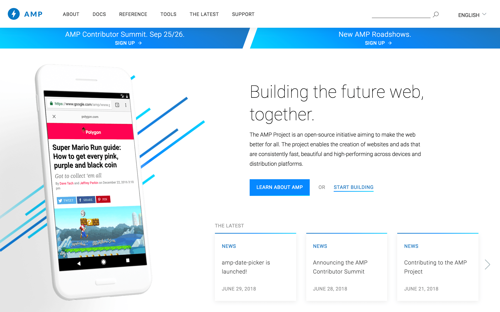
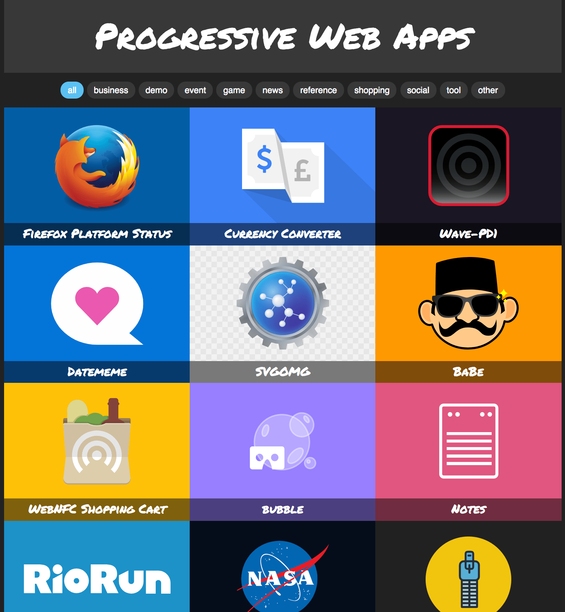
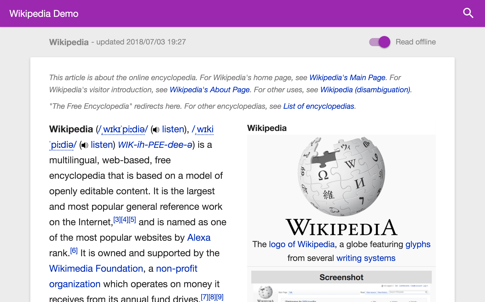

# Web 3

---

## Web Design and Modern Web App

---

### Responsive Web Design (RWD)

Responsive Web Design is a way to making a web design responsive to browser size, regarding the device type. So it works automatically across desktop, mobile, and other screens.

See this [responsive web design, animated](https://media.giphy.com/media/b2CD0Qrq2ulwY/giphy.gif).

---

### Adaptive Web Design (AWD)

While Adaptive Web Design is separating more than one web design implementation, like between desktop and mobile.

---

### Accelerated Mobile Pages (AMP)

The AMP Project is an open-source initiative aiming to make the web better for all. The project enables the creation of websites and ads that are consistently fast, beautiful and high-performing across devices and distribution platforms.

[AMP Project](https://www.ampproject.org)

---

### Progressive Web Apps (PWA)

Progressive Web Apps is a new way to deliver amazing user experiences on the web.

PWA are user experiences that have the reach of the web, and are:

* __Reliable__ - Load instantly and never show the downasaur, even in uncertain network conditions.
* __Fast__ - Respond quickly to user interactions with silky smooth animations and no janky scrolling.
* __Engaging__ - Feel like a natural app on the device, with an immersive user experience.

This new level of quality allows Progressive Web Apps to earn a place on the user's home screen.

[PWA.rocks - A selection of Progressive Web Apps](https://pwa.rocks)

